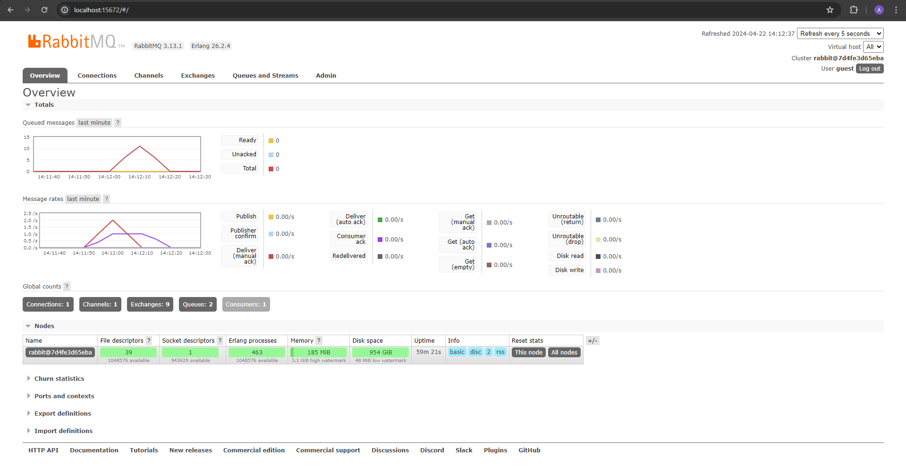
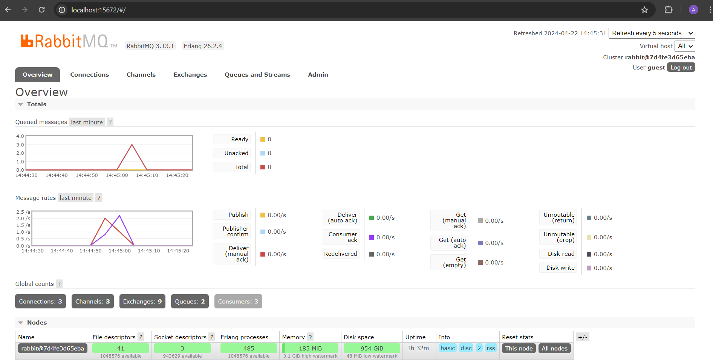
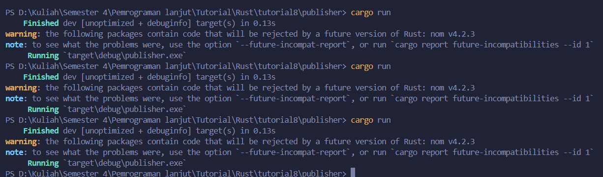
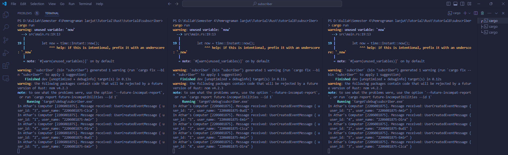

### Nama : Shaquille Athar Adista
### NPM : 2206081875

1. Apa itu amqp?
   
    amqp merupakan protokol lapisan aplikasi standar terbuka untuk middleware berorientasi pesan.  

    amqp (advance message queuing protocal) adalah protokol komunikasi yang digunakan untuk pertukaran pesan di antara aplikasi, amqp mengizinkan aplikasi untuk mengirim, menerima, dan mengonsumsi pesan secara terpisah, tanpa harus saling terhubung secara langsung. Ini memungkinkan untuk implementasi arsitektur berbasis antrian pesan (message queuing) yang dapat meningkatkan skalabilitas, ketahanan, dan fleksibilitas sistem secara keseluruhan. 

    amqp dirancang agar secara efisien mendukung messaging applications dan komunikasi.

2. What it means? guest:guest@localhost:5672 , what is the first quest, and what is the second guest, and what is localhost:5672 is for? 

    - `guest:guest@localhost:5672` untuk melukan koneksi ke server RabbitMQ menggunakan protokol amqp.
    - `guest:guest` merupakan cara untuk mengotentikasi ke server RabbitMQ. `guest:guest` menunjukkan username dan password, RabbitMQ memiliki default username `guest` yang memiliki kata sandi `guest`.
    - `localhost:5672` merupakan hostname dan portnya. `localhost` adalah nama host (dalam kasus ini adalah mesin lokal). `5672` adalah port yang digunakan. Dalam konteks tutorial ini, `localhost:5672` merupakan alamat dan port sever RabbitMQ. `localhost` menunjukkan bawah server RabbitMQ berjalan di mesin lokal. `5672` adalah port default yang digunakan oleh RabbitMQ untuk menerima koneksi.

    Jadi intinya `guest:guest@localhost:5672` adalah cara untuk melakukan otentikasi dan terhubung ke server RabbitMQ yang berjalan di mesin lokal dengan memakai username guest dan kata sandi guest.

### Spikes di RabbitMQ ketika simulating slow subscriber

pada grafik terlihat bahwa sempat terdapat 10 queue message dalam satu waktu, hal ini dikarenakan subscriber sudah ditambahkan sebuah thread::sleep yang membuat kecepatan subscriber untuk mengambil message jauh lebih lambat daripada kecepatan publisher dalam mempublish message, sehingga terjadi penumpukan message di queue.

### Spikes di RabbitMQ ketika menjalankan tiga subscriber

### console publisher

### console dari tiga subscriber

Pada gambar terlihat bahwa spike dari message queue berkurang lebih cepat dari sebelumnya, hal ini terjadi karena kita menjalankan tiga subscriber sehingga kita akan membagi tugas dalam pengambilan message yang ada di queue ke tiga subscriber berbeda sehingga queue akan jauh lebih cepat kosong.

Yang bisa di improve di publisher dan subscriber
1. Mungkin bisa membuat variable url yang berisi url, bukan langsung assign url ke dalam `new_queue_listener` agar kode lebih mudah di maintain.
2. Mungkin bisa menerapkan asynchronous atau multithread.
3. Mungkin bisa menerapkan error handling yang jauh lebih jelas.
4. penggunaan iterasi untuk hal yang berulang, seperti contohnya pada publish_event
